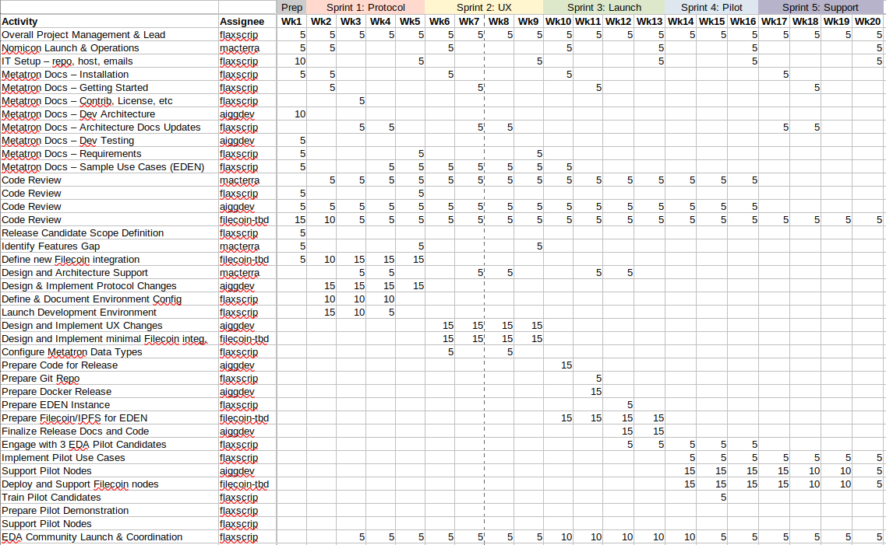
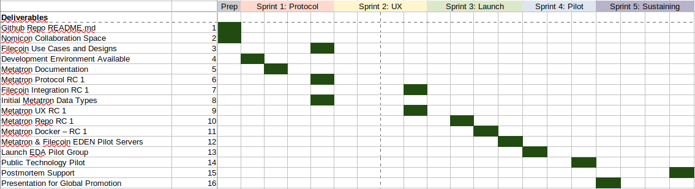
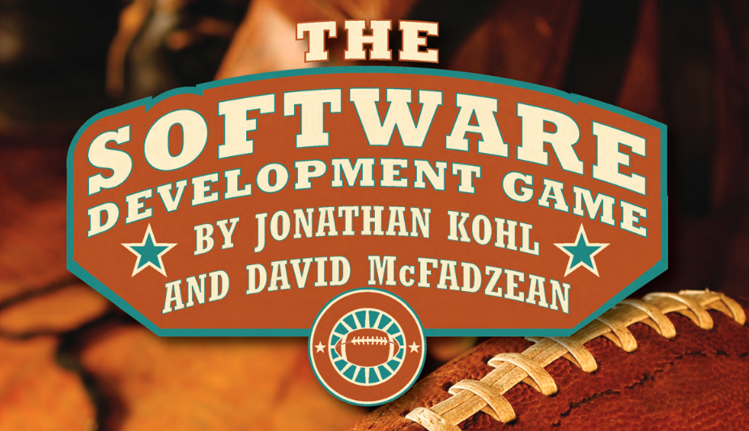

# Project Metatron

Welcome to Project Metatron.

## Project Goal

The Goal of Project Metatron is to successfully launch the [Metatron Protocol](https://github.com/macterra/metatron/blob/main/docs/README.md) to the public as per the [Open Grant Proposal](https://github.com/Flaxscrip/devgrants/blob/Flaxscrip-patch-1/open-grant-proposals/open-proposal-metatron.md) submitted to the [Filecoin Foundation](https://github.com/filecoin-project/devgrants) in August 2021.

## Ethical Data Pilot

The Metatron Protocol provides key functionality that will be immediately put to use in a technology pilot involving members from the [Ethical Data Alliance](https://ethicaldata.net/about-us/governance/) community.

A full description of the EDA's needs for peer-to-peer technology is available online: [Ethical Data Alliance - What we are doing](https://ethicaldata.net/what-we-are-doing/).

## EDEN Use Cases

In summary, the EDA community needs Metatron and Filecoin to build a data exchange network that protects data authorship and history. We call these use cases the ["EDEN Protocol"](https://edenprotocol.io).

The 4 main requirements of the EDEN Protocol are:

1. Data Notary: Document proof-of-existence (IPFS cid & Metatron xid)
1. Data Catalog: Document storage (IPFS & Filecoin)
1. Data Reputation: Document history traceability (Metatron xid)
1. Data Exchange: Document versioning rights transfer (Metatron transfer)

The EDEN Protocol will become a set of instructions, customizations, and lessons learned on how to deploy the Metatron & Filecoin environments in order to participate in the data exchange community being defined by the EDA.

## Web3 Supply Chain Management

At the outset of the Metatron Launch and EDEN Pilot, we will have implemented and demonstrated a P2P protocol for supply chain management and product traceability. While our initial user community is built around the EDA, this Web3 Supply Chain Management and Product Traceability solution will be ready to engage with other industries (food, art, medicine, etc).

## Metatron Launch and Pilot Draft Plan

The *draft* plan blow provides for 3 main outcomes:

1. Basic Integration of Metatron with Filecoin
1. Launch of Metatron Protocol and Reference Implementation
1. Configuration and Support for EDA's Pilot use of Metatron

The plan currently still misses a Python software engineer with Filecoin experience. We are actively looking at finding that resource. Please contact [flaxscrip](https://flaxscrip.github.io/flaxscrip-space/) with references.

The plan is divided in 5 Sprints:
1. Sprint 1: Protocol Work
1. Sprint 2: UX Improvements and Filecoin Integration
1. Sprint 3: Public Launch of Repo and Reference Implementation
1. Sprint 4: EDA Pilot Configuration and Support
1. Sprint 5: Sustaining, Postmortem, Presentation for Global Promotion

Because of the scarcity of expert resources and to allow coordination time with the EDA Pilot efforts, we are proposing a plan that stretches out over 20 weeks with 2 python programmers committed to ~20 hours / week. [@macterra](https://macterra.github.io/macterra-space/) will provide architecture and technology guidance for Metatron while [@flaxscrip](https://flaxscrip.github.io/flaxscrip-space/) will manage the overall effort to completion. [aiggdev](https://github.com/aiggdev) is our main Python developer, and we are looking for a *filecoin-tbd* resource.

The draft plan proposes a series of 16 deliverables that stretches out through the 20 weeks. Each deliverable can be defined as a Bounty that will be assigned to the appropriate Players. Upon completion of a deliverable, 1/16th of the project's budget would be awarded to the contributors. Each bounty can specify custom allocation of the payment to the participating players.

## Project Management and Governance

There is a pre-Filecoin history to the project that can be preserved with the continued use of [EDENomicon](https://nomicon.edenprotocol.io/) as an open governance and transparent project management methodology. If a "clean slate" is desired, we could fork a new Nomicon game specifically for this launch. This will be determined after discussion with the Filecoin Foundation team.

Nomicon is an open project management methodology that we have used successfully in numerous other software projects. For more information, please visit the [Software Development Game](https://nomicon.edenprotocol.io/Nomicon/) page on the EDENomicon.

## Join Us!

We welcome contributions and participation from everyone. Please engage through the EDENomicon game and discussions. Thank you for helping us achieve a successful launch of Metatron.

An [ODS](https://www.libreoffice.org/discover/what-is-opendocument/) version of this draft plan can be downloaded [here](Metatron_Plan_v.0.1.ods).
